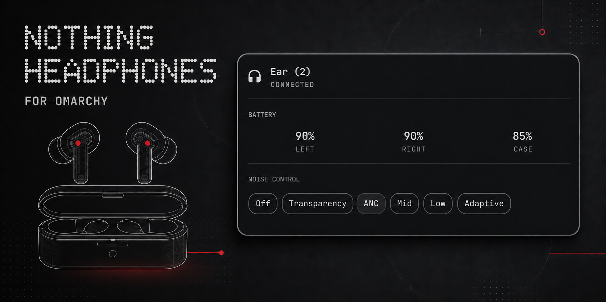

# Nothing Earbuds for Omarchy



An Omarchy Quattro bar plugin for Nothing and CMF earbuds. It shows separate
left, right, and case battery levels and provides the controls supported by the
detected model.

Nothing Ear (2) is verified. Other Nothing Ear models share the protocol but
still need field testing; CMF Buds support is experimental. Stick/Open models
show battery without ANC controls.

## Install

The bundled helper uses Omarchy's system Python and BlueZ; there is no extra
runtime dependency. Its protocol is based on the reverse-engineering documented
by [Something X](https://github.com/SoaOaoS/something-x).

```bash
omarchy plugin add https://github.com/NitzanSelwyn/omarchy-nothing-headphones.git --enable --yes
omarchy bar move io.github.nitzanselwyn.nothing-earbuds --section right
```

To update later, run
`omarchy plugin update io.github.nitzanselwyn.nothing-earbuds --yes`.
Left-click opens device details and available controls;
right-click opens Omarchy's Bluetooth panel. Use the arrow keys plus Enter, or
press `1` through `6` for a mode and `r` to refresh.

## Remove

```bash
omarchy plugin remove io.github.nitzanselwyn.nothing-earbuds --yes
```

## Check

```bash
node tests/model.test.js
/usr/bin/python3 nothingctl.py --self-test
omarchy plugin validate .
qmllint -I "$OMARCHY_PATH/shell" BarWidget.qml Panel.qml
```

If a model uses a different serial channel, change **RFCOMM channel** in the
widget settings. Channel 15 is the normal default.

This is unofficial and is not endorsed by Nothing.
